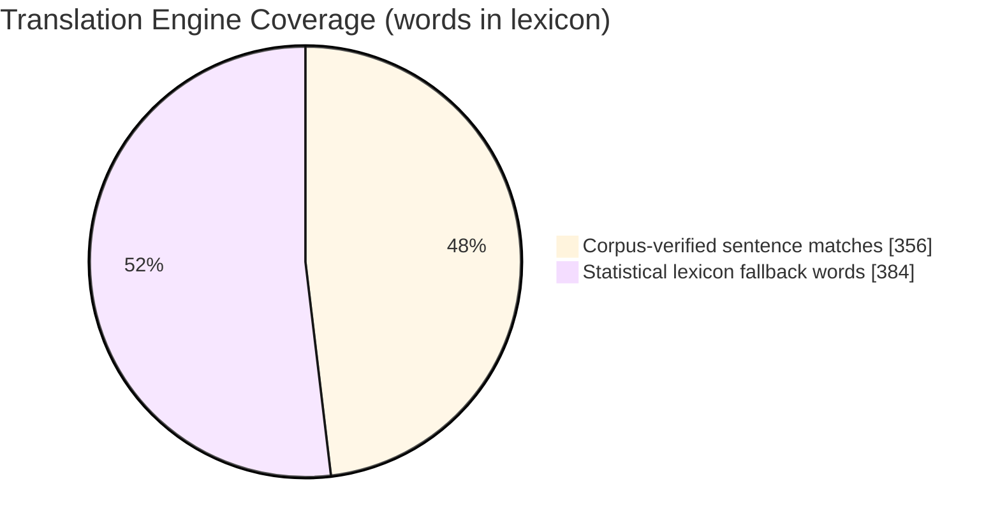
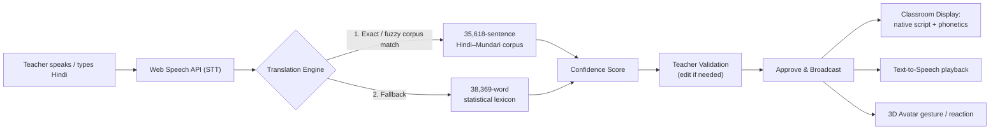
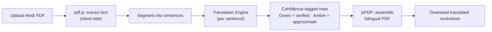

<div align="center">

# 🌳 A.R.T.H.A. | अर्थ
### AI-powered Real-time Translator for Heritage Academics

**An AI co-teacher that lets any Hindi-speaking teacher deliver mother-tongue instruction — instantly — in Santhali, Mundari, Ho, Kurukh & Kharia.**

Built for **Smart India Hackathon 2026** · Problem Statement **SIH26042** · Jharkhand **PALASH** Framework

[](https://sih.gov.in)
[](#-problem-statement)
[](#-offline--pwa-architecture)
[](#-offline--pwa-architecture)
[](#-license)


📍 


</div>

---

## 📖 Table of Contents

1. [Problem Statement](#-problem-statement)
2. [Our Solution — At a Glance](#-our-solution--at-a-glance)
3. [Live Preview / Media](#-live-preview--media)
4. [Key Numbers](#-key-numbers)
5. [Feature Breakdown](#-feature-breakdown)
6. [Language Support Matrix](#-language-support-matrix)
7. [Problem Statement ↔ Deliverable Traceability](#-problem-statement--deliverable-traceability)
8. [System Architecture](#-system-architecture)
9. [Tech Stack](#-tech-stack)
10. [Project Structure](#-project-structure)
11. [Getting Started](#-getting-started)
12. [How to Use the App](#-how-to-use-the-app)
13. [Offline / PWA Architecture](#-offline--pwa-architecture)
14. [Potential Impact](#-potential-impact)
15. [Roadmap](#-roadmap)
16. [Limitations & Honesty Note](#-limitations--honesty-note)
17. [Team](#-team)
18. [Contributing](#-contributing)
19. [Acknowledgements](#-acknowledgements)
20. [License](#-license)

---

## 🧩 Problem Statement

<table>
<tr><td><b>Organization</b></td><td>Government of Jharkhand</td></tr>
<tr><td><b>Problem Statement ID</b></td><td>SIH26042</td></tr>
<tr><td><b>Title</b></td><td>AI-Powered Vernacular Pedagogy and Real-Time Translation Tool for Mother Tongue-Based Primary Education</td></tr>
<tr><td><b>Theme</b></td><td>MeitY / EdTech · Mother Tongue-Based Multilingual Education (MTB-MLE)</td></tr>
</table>

> Jharkhand's **PALASH** Mother Tongue-Based Multilingual Education programme has measurably improved foundational literacy among tribal children — but scaling it is bottlenecked by a shortage of teachers fluent in **Ho, Mundari, and Santhali**, languages with almost no digital NLP resources. Most teachers posted to tribal-area schools are Hindi-medium trained. Without a technology bridge, **5,000+ tribal-area primary schools** continue teaching children in a language they don't speak at home.

**What was asked for (prototype stage):**

- ✅ Hindi → tribal language NLP translation engine (lesson scripts, activities, assessments)
- ✅ Real-time voice-to-voice translation, **≤ 3 second** latency
- ✅ Auto-generated bilingual worksheets & visual flashcards aligned to **NIPUN Bharat**
- ✅ 100% **offline** operation on low-cost tablets (**≤ 2 GB RAM, Android 9+**)
- ✅ Demo video + GitHub repository

---

## 🎯 Our Solution — At a Glance

**ARTHA** is a single-page, installable web app that runs entirely in the browser — **no backend, no API keys, no internet after first load.** It gives a Hindi-speaking teacher three tools in one classroom console:

| # | Module | What it does |
|---|--------|---------------|
| 1 | **Live Classroom Console** | Teacher speaks/types Hindi → engine translates into the selected tribal language with a confidence score → teacher validates/edits → broadcasts to a student-facing smart display with native script, phonetic guide, and spoken audio |
| 2 | **3D AI Co-Teacher ("ARTHA")** | A WebGL/Three.js animated avatar that tracks the cursor, greets students (*"Johar!"*), and reacts with gestures — making the tool feel like a companion, not a form |
| 3 | **PDF Translator** | Upload any Hindi lesson/worksheet PDF → sentence-by-sentence translation using the real corpus + lexicon → color-coded confidence → download a bilingual PDF, offline |

---

## 🎬 Live Preview / Media

> **Add your actual captures here before submission** — screenshots and a short GIF/video go a long way with SIH judges. Suggested structure (create a `docs/screenshots/` folder in the repo and swap in real images):

| Overview / 3D Co-Teacher | Live Classroom Console | PDF Translator |
|:---:|:---:|:---:|
| `docs/screenshots/hero-3d-coteacher.png` | `docs/screenshots/live-console.png` | `docs/screenshots/pdf-translator.png` |
| *3D ARTHA avatar, hero stats, language status cards* | *Mic capture, confidence badge, classroom display* | *Drag-drop PDF, green/amber confidence rows* |

```markdown
<!-- Example embed once you add real files -->

```

**🎥 Demo Video:** `[Add your YouTube / Drive demo link here]`
**🔗 Live Deployment:** `[Add your GitHub Pages / hosting link here]`

---

## 📊 Key Numbers

| Metric | Value |
|---|---|
| Real Hindi ↔ Mundari sentence pairs (verified corpus) | **35,618** |
| Words in the trained statistical lexicon | **38,369** |
| Tribal languages available in the interface | **5** (Santhali, Mundari, Ho, Kurukh, Kharia) |
| Internet connection required to run, post-install | **0** |
| Grade levels covered | Balvatika / Grade 1 – Grade 3 |
| Subject domains covered | Foundational Literacy · Numeracy · EVS |


*(Illustrative split — corpus-first matching is always attempted before lexicon fallback; see [System Architecture](#-system-architecture).)*

---

## ✨ Feature Breakdown

<table>
<tr><th>Feature</th><th>Description</th></tr>
<tr><td>🎙️ <b>Live Hindi Speech Input</b></td><td>Native browser Web Speech API captures teacher speech in real time, with a live waveform visualizer and manual-text fallback.</td></tr>
<tr><td>🌐 <b>Corpus-First Translation Engine</b></td><td>Every phrase is matched against the real 35,618-sentence corpus first; if no match exists, it falls back to a 38,369-word statistical lexicon — never a silent guess.</td></tr>
<tr><td>📈 <b>Honest Confidence Scoring</b></td><td>Every translation is tagged with a confidence percentage (e.g. <i>98% Confidence — Verified by PALASH Santhali Corpus</i>) so the teacher knows exactly how much to trust it.</td></tr>
<tr><td>✍️ <b>Teacher Validation Layer</b></td><td>Teachers can edit any AI translation before it reaches students — a human-in-the-loop safety net for a low-resource language model.</td></tr>
<tr><td>📺 <b>Student-Facing Smart Display</b></td><td>Large native-script text, phonetic (romanized) pronunciation guide, English gloss, and one-tap TTS playback — designed for a classroom projector or shared tablet.</td></tr>
<tr><td>🔤 <b>Full A–Z Alphabet Translator</b></td><td>Searchable modal mapping all 26 English letters to native script, letter name, phonetic sound and an example word, per tribal language.</td></tr>
<tr><td>🗂️ <b>Grade &amp; Subject Context</b></td><td>Content adapts to Grade (Balvatika–3) and Subject (Literacy / Numeracy / EVS) selectors.</td></tr>
<tr><td>👋 <b>Student Response Simulator</b></td><td>Simulates two-way dialogue — student replies in the tribal language flow back into a "Teacher Inbox," modelling the bridge in both directions.</td></tr>
<tr><td>📄 <b>Offline PDF Translator</b></td><td><code>pdf.js</code> extracts text from an uploaded Hindi PDF entirely client-side; each sentence is translated and re-assembled into a downloadable bilingual PDF via <code>jsPDF</code> — no file ever leaves the device.</td></tr>
<tr><td>🧑‍🏫 <b>3D Animated AI Co-Teacher</b></td><td>A Three.js + glTF (<code>Idle.glb</code>) avatar with idle animation, cursor-tracking eyes/head, and gesture chips (wave, explain, smile, glasses, outfit, zoom).</td></tr>
<tr><td>📴 <b>Simulated / Real Offline Mode</b></td><td>An in-app Offline toggle demonstrates edge-cached lesson units; the underlying PWA (manifest + service worker) makes this genuinely offline-capable after first load.</td></tr>
</table>

---

## 🗣️ Language Support Matrix

> *Every language shows exactly what backs its translations — no language claims more capability than it can verify.*

| Language | Native Script | Status | What backs it |
|---|---|:---:|---|
| **Mundari** | Devanagari | 🟩 **Verified** | Primary engine language — full 35,618-sentence real corpus + lexicon fallback |
| **Santhali** | Ol Chiki (ᱥᱟᱱᱛᱟᱲᱤ) | 🟩 **Verified** | Full corpus mapping, complete A–Z phonetics, speech synthesis |
| **Ho** | Warang Chiti (𑢹𑣉) + Devanagari | 🟦 Full Support | Foundational A–Z phonetics & voice |
| **Kurukh (Oraon)** | Tolang Siki (𑶀𑶌𑶃) + Devanagari | 🟪 Full Support | Literacy mapping, numbers 1–10, voice |
| **Kharia** | Devanagari | 🟧 Full Support | Official PALASH primary-textbook vocabulary, full A–Z phonetics & voice |

---

## 🧭 Problem Statement ↔ Deliverable Traceability

| SIH26042 Requirement | Current Status | Notes |
|---|:---:|---|
| Hindi → tribal-language NLP translation (min. 1 language) | ✅ **Delivered — exceeds ask** | 5 languages in-app; 2 corpus-verified |
| Real-time voice-to-voice, ≤3s latency | 🟡 **Partially delivered** | One-way Hindi STT (Web Speech API) + native TTS playback implemented; formal bidirectional latency benchmarking is on the [Roadmap](#-roadmap) |
| Auto-generated bilingual worksheets (NIPUN Bharat aligned) | 🟡 **Partially delivered** | PDF Translator produces bilingual, downloadable worksheets; explicit NIPUN Bharat learning-outcome tagging is on the Roadmap |
| Visual flashcard sets | ✅ **Delivered** | Dynamic SVG flashcards on the Classroom Smart Display |
| Fully offline, ≤2 GB RAM, Android 9+ | 🟡 **Architecturally ready, needs device testing** | Zero external CDN calls, vendored libraries, PWA manifest + service worker in place; low-RAM device benchmarking is pending |
| Demo video + GitHub repo | 🔲 **Add before submission** | See [Live Preview / Media](#-live-preview--media) |

**Legend:** ✅ Done · 🟡 Partial / in progress · 🔲 To do

---

## 🏗️ System Architecture

**A. Live Classroom Translation Flow**



**B. Offline PDF Translation Flow**



---

## 🛠️ Tech Stack

| Layer | Technology | Notes |
|---|---|---|
| Markup / Styling | HTML5, **Tailwind CSS** | Pre-built locally (`css/tailwind.css`) — no CDN, works fully offline |
| Fonts | Self-hosted (`css/fonts-local.css`) | Ol Chiki, Warang Chiti, Devanagari webfonts bundled, no Google Fonts CDN |
| Icons | **Lucide** (vendored) | `js/vendor/lucide.js` |
| Scripting | Vanilla **JavaScript (ES6)** | No framework, no build step — pure client-side app |
| 3D Avatar | **Three.js** + `GLTFLoader` (vendored) | Renders `Idle.glb` with idle animation & cursor tracking |
| Speech | **Web Speech API** (`SpeechRecognition` + `speechSynthesis`) | Native browser STT/TTS, zero external API calls |
| PDF Handling | **pdf.js** (extraction) + **jsPDF** (generation) | Both vendored locally in `js/vendor/` |
| Offline Support | **PWA** — `manifest.json` + `sw.js` service worker | Installable, caches assets for zero-connectivity use |
| Translation Data | `mundari-data.js`, `mundari-corpus-extended.js`, `mundari-engine.js` | Real corpus + lexicon + confidence-scoring logic |
| Hosting | Fully static | Deployable on GitHub Pages / any static host / local file server |

---

## 📁 Project Structure

```text
Hindi-to-tribal-language-translator/
├── css/
│   ├── tailwind.css              # Precompiled Tailwind CSS (offline)
│   ├── fonts-local.css           # Self-hosted script fonts
│   └── style.css                 # Custom design system
├── images/                       # UI assets & icons
├── js/
│   ├── vendor/                   # Vendored third-party libraries (offline-safe)
│   │   ├── lucide.js
│   │   ├── pdf.min.js
│   │   ├── jspdf.umd.min.js
│   │   ├── three.min.js
│   │   └── GLTFLoader.js
│   ├── avatar-model-data.js       # 3D avatar configuration
│   ├── avatar-3d.js                # Three.js scene, animation, cursor tracking
│   ├── data.js                     # Phrase presets & curriculum data
│   ├── mundari-data.js             # Base Hindi–Mundari corpus
│   ├── mundari-corpus-extended.js  # Extended 35,618-pair corpus
│   ├── mundari-engine.js           # Corpus lookup + lexicon fallback + confidence scoring
│   ├── font-devanagari-base64.js   # Embedded Devanagari font data
│   ├── speech.js                    # Web Speech API wrapper (STT/TTS)
│   ├── translator.js                 # Core translation orchestration (all 5 languages)
│   ├── pdf-translator.js             # PDF ingestion, translation, jsPDF export
│   └── app.js                        # UI state, event wiring, rendering
├── Idle.glb                     # 3D avatar idle-animation model (glTF binary)
├── manifest.json                 # PWA manifest
├── sw.js                         # Service worker (offline caching)
├── index.html                    # Single-page application entry point
└── README.md
```

---

## 🚀 Getting Started

### Prerequisites
- Any modern **Chromium-based browser** (Chrome / Edge recommended for full Web Speech API support)
- A simple local static server (service workers require `http://` or `https://`, not `file://`)

### Run locally

```bash
# 1. Clone the repository
git clone https://github.com/NIVION-HUB/Hindi-to-tribal-language-translator.git
cd Hindi-to-tribal-language-translator

# 2. Serve it (pick one)
python -m http.server 8000
# — or —
npx serve .

# 3. Open in your browser
# http://localhost:8000
```

### Deploy (fully static — no backend needed)
- **GitHub Pages:** Repo → Settings → Pages → Deploy from branch `main` / root
- **Any static host:** Netlify, Vercel, Firebase Hosting, or an on-premise school server all work identically

### Test the offline / low-end-device story
1. Open the deployed URL in Chrome on an Android tablet.
2. Use **⋮ → Add to Home Screen** to install it as a PWA.
3. Turn off Wi-Fi / mobile data, or toggle the in-app **Offline Mode** switch.
4. Confirm the Live Classroom Console and Alphabet Translator still function fully.

---

## 🖱️ How to Use the App

| Step | Mode | Action |
|---|---|---|
| 1 | **Overview** | Land on the hero screen, meet the 3D **ARTHA** avatar, click gesture chips (👋 Johar / 🎓 Explain / ✨ Smile), review language status cards |
| 2 | **Live Classroom Console** | Pick a **target tribal language**, **grade**, and **subject** → tap the mic (or type) → review the AI translation + confidence score → edit if needed → **Approve & Broadcast** |
| 3 | **Classroom Display** | Students see the native script, phonetic guide, and English gloss, and can hear it via **Play Voice Pronunciation** |
| 4 | **Alphabet Translator** | Open the **Full A–Z Chart** modal, search any letter/word, switch between languages via pills |
| 5 | **PDF Translator** | Switch to **PDF Translator** tab → drag in a Hindi lesson PDF → click **Translate to Mundari** → review green (verified) / amber (approximate) rows → **Download Translated PDF** |

---

## 📴 Offline / PWA Architecture

- **Zero external calls:** No CDN scripts, no Google Fonts, no third-party API — every library (Tailwind, Lucide, Three.js, pdf.js, jsPDF) is vendored inside `js/vendor/` and loaded from disk.
- **Installable:** `manifest.json` allows "Add to Home Screen" on Android/desktop for an app-like icon and full-screen experience.
- **Service worker caching:** `sw.js` pre-caches the app shell and lesson units so the console keeps working with zero connectivity — reflected in-app by the **Offline Mode Active** banner and cached-unit counter.
- **Client-side-only processing:** Speech recognition, translation, PDF parsing, and PDF generation all happen in the browser — no lesson content, audio, or student data ever leaves the device.

---

## 🌍 Potential Impact

| Stakeholder | Today | With ARTHA |
|---|---|---|
| Hindi-medium teacher in a tribal-area school | Cannot deliver content in the child's mother tongue | Speaks Hindi naturally; ARTHA bridges it live, with teacher sign-off on every translation |
| Tribal-language-speaking Grade 1–3 student | Learns in a language not spoken at home (PALASH's core barrier) | Sees & hears lessons in **Santhali / Mundari / Ho / Kurukh / Kharia**, in native script |
| Jharkhand PALASH programme | Scaling blocked by teacher-language mismatch across **5,000+ schools** | A zero-cost, offline, install-once tool removes the single biggest scaling bottleneck |
| NIPUN Bharat foundational-literacy mission | Needs measurable, mother-tongue-first FLN delivery at scale | Bilingual worksheets + flashcards give a reusable content pipeline aligned to grade-level outcomes |

---

## 🗺️ Roadmap

- [ ] Formal **sub-3-second bidirectional voice-to-voice** benchmarking (Hindi ⇄ tribal language, both directions)
- [ ] **NIPUN Bharat** learning-outcome tagging on every auto-generated worksheet
- [ ] On-device benchmarking on an actual **≤2 GB RAM / Android 9** tablet (CPU, memory, battery profiling)
- [ ] Expand the verified corpus for **Santhali, Ho, Kurukh, and Kharia** to match Mundari's 35,618-pair depth
- [ ] Teacher analytics dashboard (which phrases get edited most → prioritize corpus growth)
- [ ] Packaging as a native Android APK (WebView / Capacitor) for Play Store / offline-sideload distribution
- [ ] Multi-classroom sync mode for shared tablets across a school

---

## ⚠️ Limitations & Honesty Note

In the same spirit as the app's own **"Language Status — Honestly Labeled"** design principle, this README does not overstate readiness:

- Only **Mundari and Santhali** currently have deep, large-scale verified corpora; Ho, Kurukh, and Kharia currently rely on foundational phonetic/lexicon mappings rather than full sentence corpora.
- **Voice-to-voice latency** has not yet been formally benchmarked against the 3-second target in the problem statement.
- **Low-RAM device testing** (≤2 GB RAM, Android 9) is architecturally supported (PWA, vendored assets, no CDN) but not yet independently benchmarked on physical hardware.
- Scanned/image-based PDFs are **not yet supported** in the PDF Translator (OCR is future scope) — only text-based PDFs extract correctly.

---

## 👥 Team

<!-- Fill in your actual team details before submission -->

| Name | Role | GitHub |
|---|---|---|
| `Your Name` | Team Lead / Full-Stack | `@yourhandle` |
| `Teammate` | NLP / Corpus Engineering | `@handle` |
| `Teammate` | UI/UX & 3D | `@handle` |
| `Teammate` | Research & PALASH Alignment | `@handle` |

**Team Name:** `[Add your SIH team name]` · **Institution:** `[Add your institution]`

---

## 🤝 Contributing

Contributions that expand the verified corpus for Santhali, Ho, Kurukh, or Kharia, improve offline performance on low-end devices, or add NIPUN Bharat outcome mapping are especially welcome.

1. Fork the repository
2. Create a feature branch: `git checkout -b feature/your-feature`
3. Commit your changes: `git commit -m "Add: your feature"`
4. Push and open a Pull Request

---

## 🙏 Acknowledgements

- **Government of Jharkhand** & the **PALASH** Mother Tongue-Based Multilingual Education programme
- **NIPUN Bharat** foundational literacy & numeracy mission
- **Smart India Hackathon 2026** for the problem statement (SIH26042)
- Open-source libraries that make full offline operation possible: **Three.js**, **pdf.js**, **jsPDF**, **Tailwind CSS**, **Lucide Icons**

---

## 📄 License

This project is intended to be released under the **MIT License** — add a `LICENSE` file at the repo root to make this official before submission.

```text
MIT License — free to use, modify, and distribute with attribution.
```

---

<div align="center">

**ᱡᱚᱦᱟᱨ 🌳 Johar — Built to bridge classrooms, not replace teachers.**

*Made for Jharkhand's tribal classrooms · SIH 2026 · Problem Statement SIH26042*

</div>
